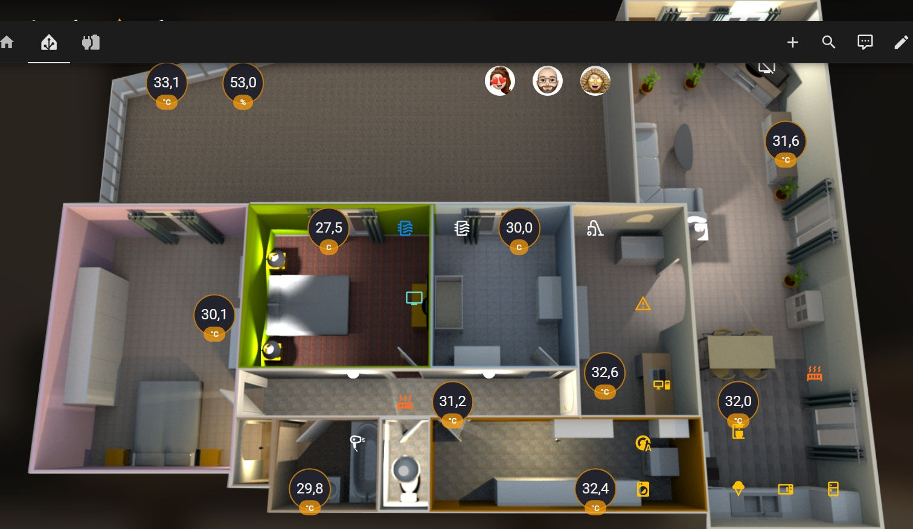
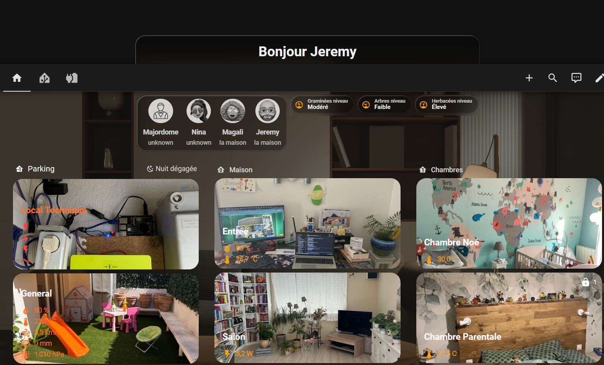

# 👋 Hi, I'm Jérémy

## Linux System Engineer • Homelab • Automation • Monitoring

[🇫🇷 Français](./README.md) | [🇬🇧 English](./README_EN.md)

---

## 📚 Table of Contents

- [About](#about)
- [Tech Stack](#tech-stack)
  - [Systems & OS](#-systems--os)
  - [DevOps & automation](#-devops--automation)
  - [Monitoring & observability](#-monitoring--observability)
  - [Homelab & self-hosting](#-homelab--self-hosting)
  - [Languages & development](#-languages--development)
  - [Virtualization, storage & cloud](#-virtualization-storage--cloud)
  - [AI & workflows](#-ai--workflows)
- [Areas of Interest](#areas-of-interest)
- [Homelab](#homelab)
- [Projects](#projects)
- [GitHub Statistics](#github-statistics)
- [Contact](#contact)

---

## 🧑‍💻 About

I'm Jérémy, passionate about Linux system administration, server hardware, automation and monitoring. My GitHub is a portfolio of projects, experiments and documentation around **open source**, **self-hosted** and **DevOps** environments.

My approach: prioritize systems that are simple to operate, observable, secure and well-documented. I like to understand how a platform works, automate it progressively, then share a reproducible solution.

---

## 🛠️ Tech Stack

### 🖥️ Systems & OS

| Icon | Tool | Usage |
|:---:|---|---|
| 🐧 | **Linux** | System administration, services and production environments |
| 🔴 | **Debian** | Stable system for servers and self-hosted services |
| 🟠 | **Ubuntu** | Development, servers and experimentation |
| 🟣 | **CentOS** | Administration of enterprise-oriented Linux environments |
| 🍓 | **Raspberry Pi OS** | Lightweight systems for homelab nodes and services |
| 🪟 | **Windows 10** | Primary workstation and application compatibility |

### ⚙️ DevOps & automation

| Icon | Tool | Usage |
|:---:|---|---|
| ⌨️ | **Shell / Bash** | Administration scripting, recurring tasks and CLI tooling |
| 🔴 | **Ansible** | Infrastructure as Code & agentless automation |
| 🧩 | **Jinja** | Parameterizable configuration templates for Ansible |
| 🐳 | **Docker** | Containerization and reproducible service deployment |
| 🔁 | **n8n** | Visual workflow automation and integrations |
| 🧭 | **Portainer** | Simplified management of Docker environments |

### 📈 Monitoring & observability

| Icon | Tool | Usage |
|:---:|---|---|
| 🟠 | **Grafana** | Dashboards, visualization and metrics correlation |
| 🔥 | **Prometheus** | Collection, querying and alerting of time series metrics |
| 🟣 | **VictoriaMetrics** | High-efficiency metrics storage and supervision |
| 🟢 | **Netdata** | Real-time host monitoring and diagnostics |
| 🧭 | **Homepage** | Centralized operational portal for homelab services |
| 🟡 | **Uptime Kuma** | Availability monitoring and incident notifications |

#

## 🏠 Homelab & self-hosting

| Icon | Tool | Usage |
|:---:|---|---|
| 🏡 | **Home Assistant** | Home automation, integrations and automations |
| 🛡️ | **Pi-hole** | Local DNS, ad filtering and first layer of security |
| 🎬 | **Jellyfin** | Free self-hosted media server |
| 🟡 | **Plex** | Media library and multi-device streaming |
| 🔐 | **Tailscale** | Mesh private network and secure remote access |
| 🌐 | **Caddy** | Reverse proxy, automatic HTTPS and service publishing |

### 💻 Languages & development

| Icon | Tool | Usage |
|:---:|---|---|
| 🐍 | **Python** | Automation, tooling and operations scripts |
| 🟨 | **JavaScript** | Application-side scripts and integrations |
| 🟩 | **Node.js** | Event-driven backend services and tools |
| 🌐 | **HTML** | Semantic structure of web interfaces |
| 🎨 | **CSS** | Styling and responsive design |
| 🦋 | **Dart** | Application development and experimentation |
| 🐦 | **Swift** | Apple application development and artifact generation |

### 🧱 Virtualization, storage & cloud

| Icon | Tool | Usage |
|:---:|---|---|
| 🟧 | **Proxmox** | Virtualization, containers and homelab node management |
| 🟦 | **VMware ESXi** | Hypervisor and virtualized platform experimentation |
| 🪣 | **MinIO** | S3-compatible object storage in self-hosting |
| ☁️ | **AWS** | Cloud services and distributed architecture understanding |
| 🔵 | **Dell PowerFlex** | Software-defined storage and enterprise infrastructure |
| 🗄️ | **TrueNAS** | NAS, storage, file sharing and data services |

### 🤖 AI & workflows

| Icon | Tool | Usage |
|:---:|---|---|
| 🧠 | **GPT** | Assistance, generation and acceleration of technical workflows |
| ✨ | **Claude** | Analysis, writing and documentary reasoning support |
| 🦣 | **Mammouth AI** | AI tools orchestration for productivity and experimentation |
| 🔗 | **n8n + AI** | Automated workflows combining services, data and models |

---

## 🎯 Areas of Interest

- Linux system administration and operational best practices
- Infrastructure as Code with Shell, Ansible and Jinja
- Monitoring, alerting and pragmatic observability
- Docker, self-hosting and open source services
- Storage, NAS, TrueNAS, MinIO and Dell PowerFlex
- Homelab, Raspberry Pi, Proxmox and VMware ESXi
- Home Assistant, Pi-hole, Jellyfin, Plex and Tailscale
- AI applied to workflows with GPT, Claude and n8n

---

## 🏠 My homelab

My homelab allows me to learn, test, break, rebuild and document solutions around Linux, Docker, monitoring, home automation and self-hosting. It's my laboratory for experimentation with all DevOps technologies.

**For a detailed inventory of all my equipment (hardware, specifications, status)**, see the [**HARDWARE**](./HARDWARE_EN.md) file.

---

## 🏠 Homelab

My homelab is a learning and validation environment: I can deploy, measure, break, rebuild and document solutions for Linux, Docker, monitoring, home automation and self-hosting.

| Domain | Summary |
|---|---|
| 🧪 Compute | Main PC, CubieBoard, Raspberry Pi 5 and Mac mini |
| 🐳 Containers | Docker on Raspberry Pi 5 for self-hosted services |
| 📊 Observability | Dedicated Raspberry Pi 3 for monitoring |
| 🌐 Network | TP-Link equipment, D-Link PoE and Ubiquiti switch |
| 🏡 Services | Home Assistant, Pi-hole, Jellyfin, Plex and Tailscale |
| 🧱 Security | HIKVision cameras and recorder, filtering DNS and private access |

> Hardware details and evolving inventory are documented in **[HARDWARE.md](./HARDWARE.md)**

---

## 🚀 Projects

> Repositories are released progressively after cleaning credentials, tokens, API keys, `.env` files and private infrastructure information.

| Project | Description | Status |
|---|---|:---:|
| 🏠 **Home Assistant Lab** | Home automation dashboard, integrations, automations and monitoring | In progress |
| 📊 **Monitoring Stack** | Grafana, Prometheus, VictoriaMetrics and Netdata for system monitoring | In progress |
| 🐳 **Docker Homelab** | Self-hosted services deployed with Docker Compose | In progress |
| 🔐 **WebDAV / TrueNAS** | Secure file access and storage documentation | In progress |
| ⚙️ **Ansible Lab** | Playbooks and roles for automating Linux hosts | To be published |
| 🤖 **n8n Automation** | Automation workflows and AI use cases | In progress |

---

## 🖼️ Home Assistant Preview

---

## 📊 GitHub Stats

> Private repositories, unpublished projects and professional environments are not represented in public statistics.

---

## 🔥 GitHub Streak

---

## 📈 GitHub Activity

---

## 📌 Repository Ideas to Publish

| Repository | Description |
|------------|-------------|
| `ansible-linux-lab` | Ansible playbooks for automating Linux tasks |
| `docker-compose-homelab` | Docker Compose stacks for self-hosted services |
| `monitoring-lab` | Dashboards, exporters and Grafana / Prometheus configurations |
| `home-assistant-lab` | Examples of dashboards, automations and integrations |
| `bash-admin-scripts` | Useful Shell scripts for system administration |
| `truenas-webdav-lab` | Documentation around TrueNAS and WebDAV |
| `n8n-ai-workflows` | n8n workflows for automation and AI |

---

## 📫 Contact

---

### 🐧 Linux • DevOps • Automation • Monitoring • Homelab

